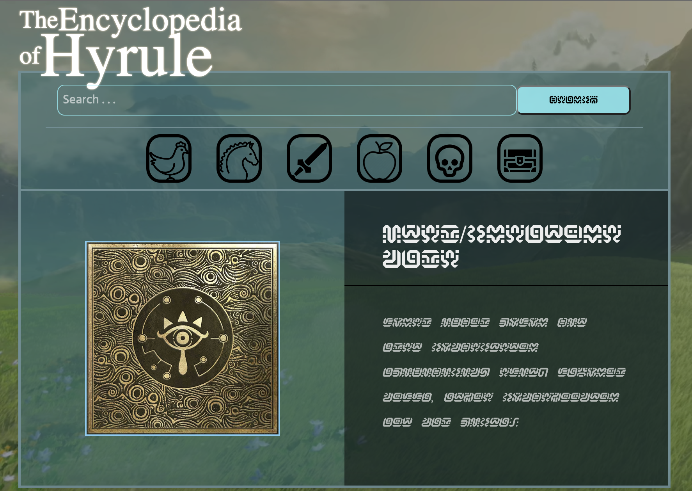

# Breath of the Wild Encyclopedia
A collaborative encyclopedia about the world of Hyrule from Nintendo's popular "The Legend of Zelda" game franchise.

**Link to project:** [Test it out here!](https://botw-encyclopedia.netlify.app/)

## How It's Made

**Tech used:** HTML, CSS, JavaScript

An extensive database for items, creatures, weapons, and armor for the world of Hyrule incorporating the BotW API [https://gadhagod.github.io/Hyrule-Compendium-API/#/] created by Aarav Borthakur [https://github.com/gadhagod]. 

An autocomplete search bar allows users to find exact and/or similar matches to their search query.

https://user-images.githubusercontent.com/96492221/191335897-fa8aba98-4fcd-499f-8e96-f51f1b64af96.mp4

Alternatively, users can search with the forward or back arrow through individual list sets available through the API by clicking on the icons for the following categories:

https://user-images.githubusercontent.com/96492221/191334788-5e8b49ba-f591-444d-ab0d-a3705a5e1da1.mp4

* Food Creatures
* Non-food Creatures
* Equipment
* Material
* Monsters
* Treasure

## Lessons Learned

Learned a substantial amount about object manipulation in JavaScript.

## Authors and Contributors

This project was created by [Minh](https://github.com/doanaminh) and [Meghann](https://github.com/meghannfh)
